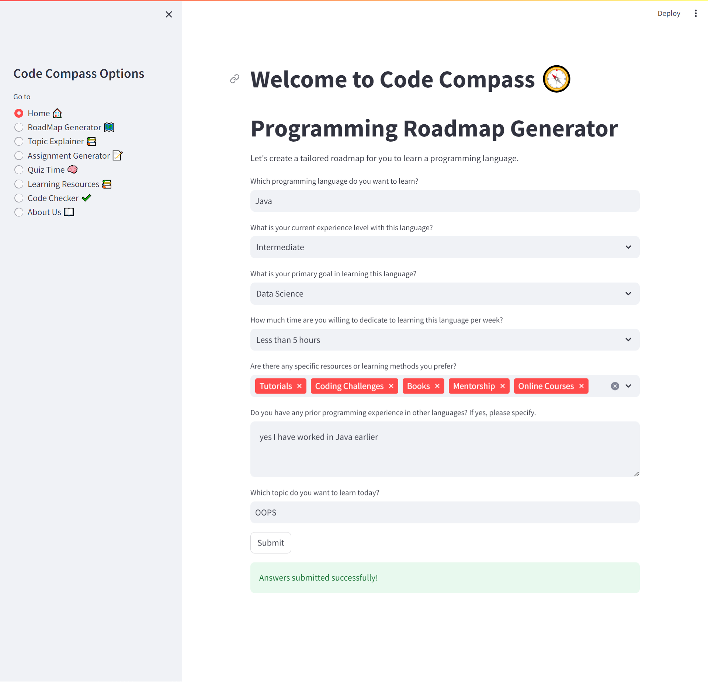
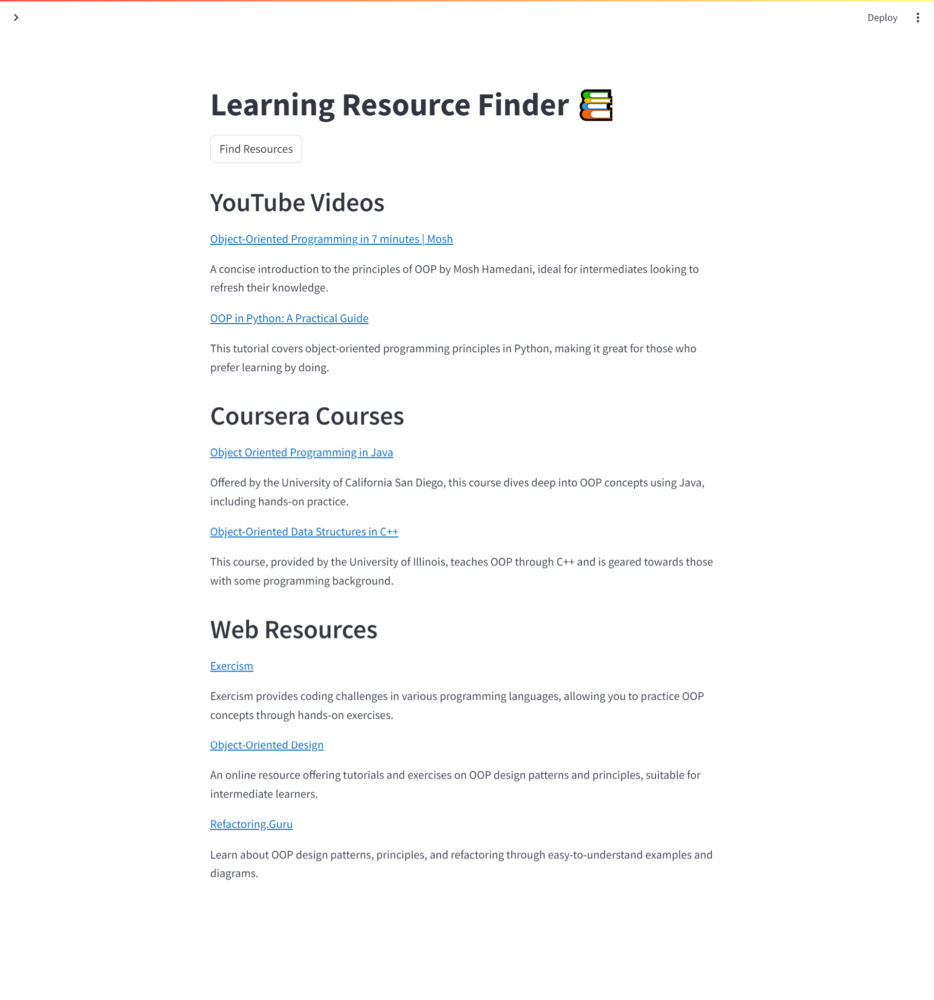

# Code Compass 

## About Code Compass

Welcome to Code Compass, your ultimate companion for navigating the world of programming. Whether you're a beginner or an advanced developer, our tailored roadmap and resources will guide you through learning new languages, mastering concepts, and achieving your coding goals.

## Features

- **RoadMap Generator 🗺️**: Create personalized learning paths for your programming journey.
- **Topic Explainer 📚**: Get detailed explanations of specific programming topics and concepts.
- **Assignment Generator 📝**: Generate custom assignments to practice and reinforce your learning.
- **Quiz Time 🧠**: Test your knowledge with quizzes.
- **Learning Resources 📚**: Access a curated list of resources for further learning.
- **Code Checker ✔️**: Validate and improve your code with our code checking tool.
- **About 📖**: Learn more about Code Compass and our mission.

## Getting Started

### Prerequisites

- Python 3.7 or higher
- Streamlit
- OpenAI API Key (for Azure)

### Installation

1. Clone the repository:
   ```sh
   git clone https://github.com/Jaweria-B/code-compass.git
   ```
2. Navigate to the project directory:
   ```sh
   cd code-compass
   ```
3. Install the required dependencies:
   ```sh
   pip install -r requirements.txt
   ```
4. Set up environment variables:
   ```sh
   cp .env.example .env
   ```
   Edit the `.env` file to include your OpenAI API Key and Azure Endpoint.

### Running the Application

1. Run the Streamlit application:
   ```sh
   streamlit run app.py
   ```
2. Open your web browser and go to `http://localhost:8501` to access Code Compass.

## Screenshots

### Home Page


### Roadmap Generator Page


### Resources Page


### Roadmap Generator Page


